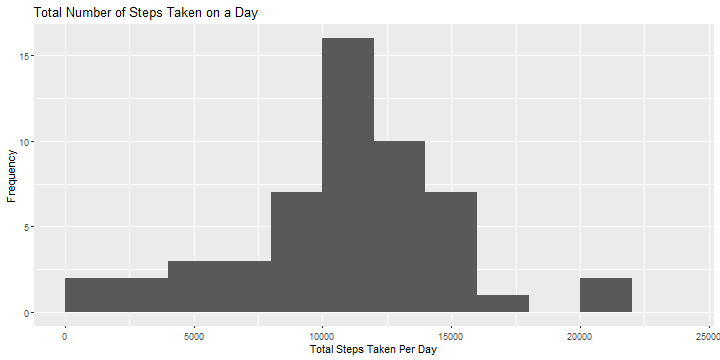
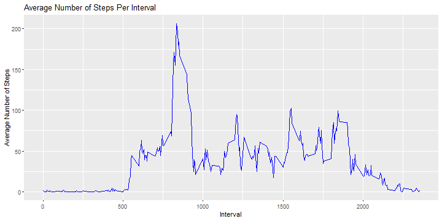
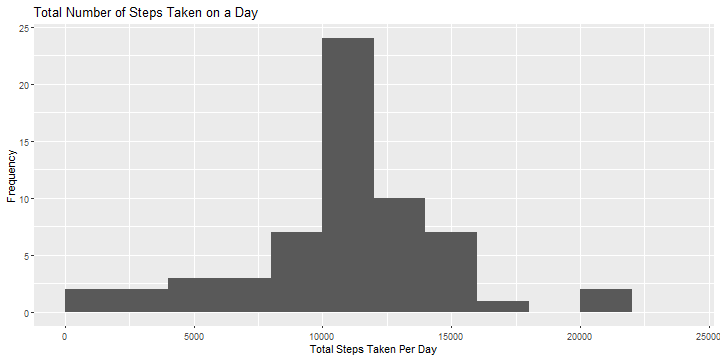
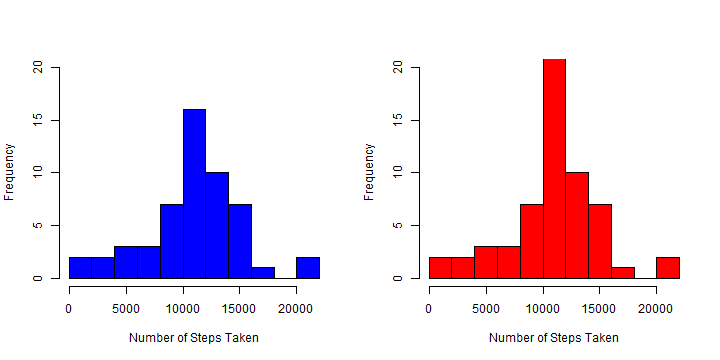
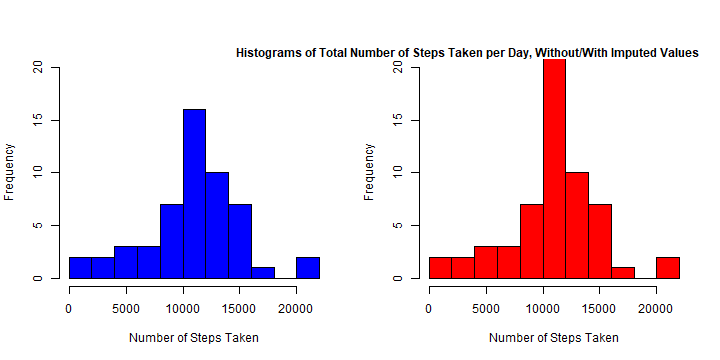
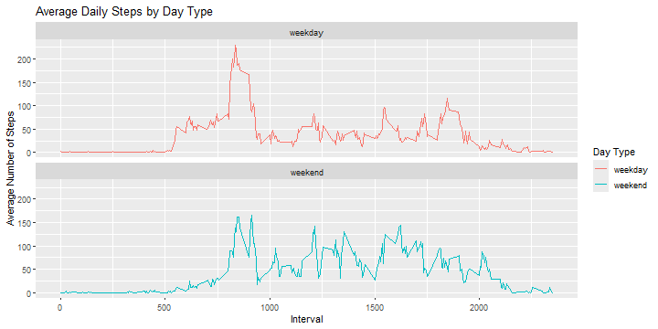

# Introduction

This assignment will be described in multiple parts. You will need to write a report that answers the questions detailed below. Ultimately, you will need to complete the entire assignment in a single R markdown document that can be processed by knitr and be transformed into an HTML file.

This assignment will be evaluated via peer assessment so it is essential that your peer evaluators be able to review the code for your analysis.

# Loading and Pre-Processing Data


``` r
# Loading packages
library(ggplot2)
library(dplyr)


# Unzipping the file and reading it
path = getwd()
unzip("activity.zip", exdir = path)

activity <- read.csv("activity.csv")

# Setting date format to help get the weekdays of the dates
activity$date <- as.POSIXct(activity$date)

# Getting the days of all the dates on the dataset
day <- weekdays(activity$date)

# Combining the dataset with the weekday of the dates
activity <- cbind(activity, day)

# Viewing the processed data
summary(activity)
```

```
##      steps             date                           interval          day           
##  Min.   :  0.00   Min.   :2012-10-01 00:00:00.00   Min.   :   0.0   Length:17568      
##  1st Qu.:  0.00   1st Qu.:2012-10-16 00:00:00.00   1st Qu.: 588.8   Class :character  
##  Median :  0.00   Median :2012-10-31 00:00:00.00   Median :1177.5   Mode  :character  
##  Mean   : 37.38   Mean   :2012-10-30 23:32:27.53   Mean   :1177.5                     
##  3rd Qu.: 12.00   3rd Qu.:2012-11-15 00:00:00.00   3rd Qu.:1766.2                     
##  Max.   :806.00   Max.   :2012-11-30 00:00:00.00   Max.   :2355.0                     
##  NA's   :2304
```

# Question 1 - What is the mean total number of steps taken per day?

The question states any missing values in the data set can be ignored. From using the summary functions previously, it is already known that there are NA values within the steps variable, so these can be removed. After calculating the total number of steps per day, we plot a histogram in order to visualize the data


``` r
# Calculating total steps taken on a day ignoring NA
steps_day<-activity %>%
  filter(!is.na(steps))%>%
  group_by(date)%>%
  summarise(total_steps = sum(steps))
  
# Plotting a histogram using ggplot2
g <- ggplot(steps_day, aes(x = total_steps)) + 
  geom_histogram(breaks = seq(0, 25000, by = 2000)) + 
  xlab("Total Steps Taken Per Day") + 
  ylab("Frequency") + 
  ggtitle("Total Number of Steps Taken on a Day")

print(g)
```



We are also asked to calculate the mean and median of total steps per day:


``` r
mean(steps_day$total_steps)
```

```
## [1] 10766.19
```

``` r
median(steps_day$total_steps)
```

```
## [1] 10765
```

# Question 2 - What is the average daily activity pattern?

The second question asks of us to calculate the average daily steps per interval of 5 minutes and graph the results in a line plot. We first remove the NAs, then group and summarize the data by interval, calculating the average steps with the mean function.


``` r
# Calculating the average number of steps taken, averaged across all days by 5-min intervals.

steps_interval<-activity %>%
  filter(!is.na(steps))%>%
  group_by(interval)%>%
  summarise(average_steps = mean(steps))

# Plotting a histogram using ggplot2
g <- ggplot(steps_interval, mapping = aes(interval, average_steps)) + 
  geom_line(col = "blue") +
  xlab("Interval") + 
  ylab("Average Number of Steps") + 
  ggtitle("Average Number of Steps Per Interval")

print(g)
```



We are then asked to find the interval with highest average steps:


``` r
# Calculating the average number of steps taken, averaged across all days by 5-min intervals.

steps_interval[which.max(steps_interval$average_steps), ]
```

```
## # A tibble: 1 × 2
##   interval average_steps
##      <int>         <dbl>
## 1      835          206.
```

# Question 3- Imputing Missing Values

In order to impute the missing data we firstly need to see the total missing values.


``` r
# Calculate and report the total number of missing values in the dataset :
data.frame(steps=sum(is.na(activity$steps)), 
           interval=sum(is.na(activity$interval)), 
           date=sum(is.na(activity$date)))
```

```
##   steps interval date
## 1  2304        0    0
```

The second step is to impute missing values with the mean number of steps per interval as calculated in question 2. The resulting dataset is then used to display a histogram of the total number of steps and the calculation of mean and median number of steps.


``` r
# Impute missing values with the mean number of steps per interval as calculated in question 2:
steps_impute <- steps_interval$average_steps[match(activity$interval, steps_interval$interval)]
activity_imputed <- transform(activity, 
                             steps = ifelse(is.na(activity$steps), yes = steps_impute, no = activity$steps))

# Create a new dataset that is equal to the original dataset but with the missing data filled in.

steps_day_imputed<-activity_imputed %>%
  group_by(date)%>%
  summarise(total_steps = sum(steps))

# Make a histogram of the total number of steps 

g <- ggplot(steps_day_imputed, aes(x = total_steps)) + 
  geom_histogram(breaks = seq(0, 25000, by = 2000)) + 
  xlab("Total Steps Taken Per Day") + 
  ylab("Frequency") + 
  ggtitle("Total Number of Steps Taken on a Day")

print(g)
```



We calculate and report the mean and median total number of steps taken per day:


``` r
# Calculate and report the mean and median total number of steps taken per day.

mean(steps_day_imputed$total_steps)
```

```
## [1] 10766.19
```

``` r
median(steps_day_imputed$total_steps)
```

```
## [1] 10766.19
```

Comparing the results before and after imputation gives the following graphs:


``` r
# Compare the results after imputation
par(mfrow = c(1, 2))

hist(steps_day$total_steps,xlab="Number of Steps Taken", col="blue",breaks=15, ylim=c(0, 20), main=NULL)
hist(steps_day_imputed$total_steps, xlab="Number of Steps Taken", col="red",breaks=15, ylim=c(0, 20), main=NULL)
```



``` r
mtext("Histograms of Total Number of Steps Taken per Day, Without/With Imputed Values",adj=0.95, font=2)
```



Comparing the results before and after imputation gives the following numbers:


``` r
# Compare means and medians after imputation
rbind(c(mean(steps_day$total_steps),median(steps_day$total_steps)),
      c(mean(steps_day_imputed$total_steps),median(steps_day_imputed$total_steps)))
```

```
##          [,1]     [,2]
## [1,] 10766.19 10765.00
## [2,] 10766.19 10766.19
```

We can see that there are no changes in the mean and slight difference in the median, however, the difference is not substantial. In the histogram we can see a change in the frequencies, which is as expected, given the type of imputation we performed

# Question 4 - Are there differences in activity patterns between weekdays and weekends?

We first create a column that will signal us if the dfay is a weekday or a weekend. We use the imputed data, resulting from question 3. This new column in then used to create groups together with the interval, in order to calculate average steps. Finally a panel plot is created with two graphs - one for weekdays and one for weekends. The x axis indicates each 5 minute interval, and the y axis shows the average number of steps taken.


``` r
# Perform summarization for weekends and weekdays per interval
activity_daytype<-activity_imputed%>%
  mutate(day_type=ifelse(day=="Saturday" | day == "Sunday","weekend","weekday"))%>%
  group_by(day_type,interval)%>%
  summarise(average_steps = mean(steps, na.rm = TRUE))

# Plotting using ggplot2
g <-  ggplot(activity_daytype, aes(x = interval , y = average_steps, color = day_type)) + 
  geom_line() + ggtitle("Average Daily Steps by Day Type") + 
  xlab("Interval") + 
  ylab("Average Number of Steps") +
  facet_wrap(~day_type, ncol = 1, nrow=2) +
  scale_color_discrete(name = "Day Type")

print(g) 
```



We can see there is a difference between weekday and weekend average steps.
